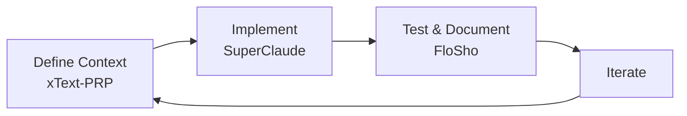

# SupaFloSho 🚀✨
> The Ultimate AI-Driven Development Framework

**SupaFloSho** unifies three powerful frameworks into one cohesive development experience:
- **xText-PRP** - Context engineering for AI-driven development
- **SuperClaude** - Enhanced commands and personas for Claude Code  
- **FloSho** - Visual testing and automatic documentation generation

## 🎯 Why SupaFloSho?

Instead of juggling multiple tools, SupaFloSho provides a seamless workflow:

1. **Context Engineering** (xText) → Define what you're building with PRPs
2. **Smart Implementation** (SuperClaude) → Execute with specialized commands and personas
3. **Test & Document** (FloSho) → Automatically capture and document everything

## ✨ Key Features

### 🧠 Context Engineering (from xText-PRP)
- **Product Requirements Prompts (PRP)** - Structured project initialization
- **Context Management** - Fill Claude's context window with the right information
- **Self-Validation** - Built-in quality gates and checkpoints

### 🛠️ Enhanced Commands (from SuperClaude)
- **23 Specialized Commands** - Combined command set from both frameworks
- **Smart Personas** - 11 AI specialists for different domains
- **MCP Integration** - Context7, Sequential thinking, UI components, browser automation

### 📸 Visual Testing & Docs (from FloSho)
- **Flow Documentation** - Capture user journeys with screenshots
- **API Testing** - Visual request/response documentation
- **Auto-Generated Guides** - User manuals created from test runs

## 🚀 Quick Start

### Installation

```bash
# Clone the repository
git clone https://github.com/a2thalex/SupaFloSho.git
cd SupaFloSho

# Install dependencies
npm install
pip install -r requirements.txt

# Run the unified installer
python setup/install.py --profile complete
```

### Basic Usage

1. **Initialize a Project**
```bash
# Start with context engineering
/xt:init "I want to build a task management app"

# SupaFloSho will:
# - Generate a comprehensive PRP
# - Set up project structure
# - Configure personas and commands
```

2. **Implement Features**
```bash
# Use SuperClaude commands with xText context
/sc:implement "user authentication"
/sc:design "dashboard layout"
/sc:analyze "performance bottlenecks"
```

3. **Test and Document**
```javascript
// Automatically generate documentation while testing
const flosho = new FloSho('my-app');
await flosho.flow('User Journey', steps);
// Creates visual guides and API docs
```

## 📁 Project Structure

```
SupaFloSho/
├── .claude/                    # Claude configuration
│   ├── CLAUDE.md              # Unified global rules
│   ├── commands/              # All slash commands
│   │   ├── context/           # xText commands (/xt:*)
│   │   ├── superclaude/       # SuperClaude commands (/sc:*)
│   │   └── flosho/            # FloSho commands (/fs:*)
│   └── personas/              # Smart AI personas
├── core/                      # Core framework logic
│   ├── context/               # Context engineering system
│   ├── prp/                   # PRP templates and generator
│   ├── personas/              # Persona definitions
│   └── commands/              # Command implementations
├── testing/                   # FloSho framework
│   ├── flosho.js             # Core testing library
│   ├── docs-generator.js      # Documentation engine
│   └── examples/             # Example test flows
├── mcp/                      # MCP server integrations
│   ├── context7/             # Library documentation
│   ├── sequential/           # Complex reasoning
│   ├── magic/                # UI components
│   └── playwright/           # Browser automation
├── templates/                # Project templates
│   ├── prp/                  # PRP templates
│   └── flows/                # FloSho flow templates
└── docs/                     # Documentation
```

## 🎯 Unified Command System

### Context Commands (xText)
- `/xt:init` - Initialize project with PRP
- `/xt:context` - Manage context window
- `/xt:prp` - Generate/update PRPs
- `/xt:validate` - Run validation checks

### SuperClaude Commands
- `/sc:implement` - Build features
- `/sc:analyze` - Analyze code/issues
- `/sc:design` - Design architecture
- `/sc:test` - Generate tests
- *...and 12 more*

### FloSho Commands
- `/fs:flow` - Define test flows
- `/fs:capture` - Take screenshots
- `/fs:document` - Generate docs
- `/fs:api` - Test APIs visually

## 🎭 Integrated Personas

SupaFloSho personas now understand context from PRPs:

- **🏗️ architect** - Uses PRP to design systems
- **🎨 frontend** - Implements UI based on PRP specs
- **⚙️ backend** - Builds APIs matching PRP requirements
- **🧪 tester** - Creates FloSho flows from PRP scenarios
- *...and more specialists*

## 🔄 The SupaFloSho Workflow



### Example: Building a Todo App

```bash
# 1. Initialize with context
/xt:init "Todo app with real-time sync and collaboration"
# → Generates comprehensive PRP with requirements

# 2. Implement with smart commands
/sc:implement "todo CRUD operations"
# → Backend persona creates API endpoints

/sc:design "responsive todo interface"  
# → Frontend persona builds UI components

# 3. Test and document
/fs:flow "Complete todo workflow"
# → FloSho captures entire user journey
# → Auto-generates user manual and API docs
```

## 🚦 Installation Profiles

Choose your setup:

```bash
# Complete installation (recommended)
python setup/install.py --profile complete

# Just core + commands
python setup/install.py --profile minimal

# Developer setup with all tools
python setup/install.py --profile developer

# Custom selection
python setup/install.py --interactive
```

## 📊 Benefits of Unification

1. **No Redundancy** - Commands and features complement each other
2. **Shared Context** - PRPs inform personas and test scenarios
3. **Automatic Documentation** - FloSho documents what you build
4. **Smarter AI** - Personas understand project context better
5. **Streamlined Workflow** - One framework, complete coverage

## 🤝 Contributing

We welcome contributions! The unified architecture makes it easier to:
- Add new commands that leverage all three systems
- Create personas that understand PRPs
- Build FloSho flows from PRP scenarios
- Enhance MCP integrations

## 📚 Documentation

- [Getting Started Guide](docs/getting-started.md)
- [Command Reference](docs/commands.md)
- [PRP Templates](docs/prp-templates.md)
- [FloSho Patterns](docs/flosho-patterns.md)
- [Persona Guide](docs/personas.md)

## 🙏 Credits

SupaFloSho combines the best of:
- **xText-PRP** by Gregory Reeves (Inkwell Technology Studios)
- **SuperClaude** by the NomenAK team
- **FloSho** testing framework

## 📄 License

MIT License - Use freely in your projects

---

**SupaFloSho** - Where context meets implementation meets documentation 🚀

*"Most development failures are coordination failures. SupaFloSho coordinates everything."*